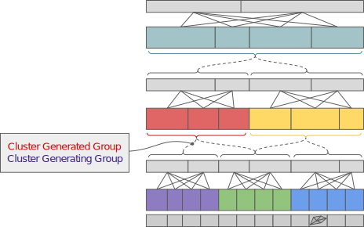
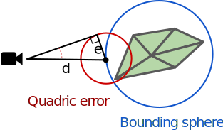
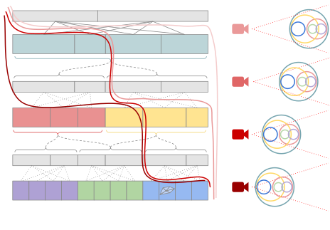
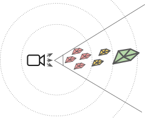
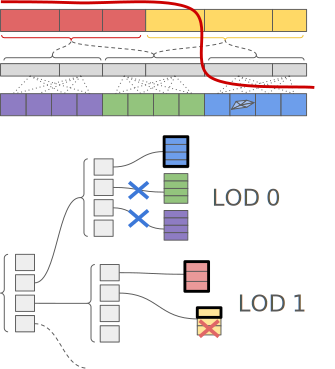

# nv_cluster_lod_builder <!-- omit from toc -->


**nv_cluster_lod_builder** is a _continuous_ level of detail (LOD) mesh library.
Continuous LOD allows for fine-grained control over geometric detail within a
mesh, compared to traditional discrete LOD. Clusters of triangles are carefully
precomputed by decimating the original mesh in a way that they can be seamlessly
combined across different LOD levels. At rendering time, a subset of these
clusters is selected to adaptively provide the required amount of detail as the
camera navigates the scene.

Key features of continuous LOD systems include:

- **Fast rendering with more detail:** Triangles are allocated where they are
  most needed.
- **Reduced memory usage with geometry streaming:** Particularly beneficial for
  ray tracing applications.

This library serves as a quick placeholder or learning tool, demonstrating the
basics of creating continuous LOD data. For a reference implementation of the
rendering system, see
https://github.com/nvpro-samples/vk_lod_clusters.

**Input:** a triangle mesh with millions of triangles

**Output:**

1. [nvclusterlod/nvclusterlod_mesh.h](include/nvclusterlod/nvclusterlod_mesh.h) - decimated clusters of the
   original mesh, with groupings and relations to other groups
2. [nvclusterlod/nvclusterlod_hierarchy.h](include/nvclusterlod/nvclusterlod_hierarchy.h) - a spatial
   hierarchy of *cluster groups* to improve performance of runtime cluster
   selection for rendering

To render, select *cluster groups* where:

- Detail or decimation error of the group is small enough, relative to the camera
- Detail or decimation error of the group's decimated geometry is not small enough

This is the gist, but the library also does some massaging of the values that
feed into these checks to make sure multiple LODs do not render over the top of
each other. See below.

Geometry can be streamed in when needed to save memory.

**Table of Contents**

- [How it works](#how-it-works)
  - [Building LODs](#building-lods)
  - [Selecting Clusters](#selecting-clusters)
  - [Spatial Hierarchy](#spatial-hierarchy)
  - [Streaming](#streaming)
  - [References](#references)
- [Usage Example](#usage-example)
- [Build Integration](#build-integration)
  - [Dependencies](#dependencies)
- [License](#license)
- [Limitations](#limitations)

## How it works

The key to continuous LOD is a decimation strategy that allows regular
watertight LOD transitions across a mesh. Such transitions require borders that
match on both sides, and are obtained by keeping the border of the triangle
edges fixed during decimation. Since these edges do not change, successive
iterations of decimation must choose different borders and fix new edges to let
the old ones decimate.

To explain why, consider forming groups of triangles and decimating triangles
within. Then grouping the decimated groups and decimating again *recursively*
until there is just one root group. In this case, some of the vertices would
remain fixed across the entire hierarchy, and would be decimated only when the
last two groups are grouped and decimated to form the coarsest LOD. To avoid
this, new groups must instead be allowed to cross any border, and in fact
encouraged to.

This library makes groups of geometry and decimates within *groups*. Decimated
geometry is then re-grouped, encouraging crossing the old group's borders when
forming new groups. Groups are made from clusters of triangle rather than just
triangles for performance reasons. A group is a cluster of clusters of
triangles. Whole triangle clusters are swapped in and out at runtime for detail
transitions.

### Building LODs


The image above shows the process that is repeated to create LODs until there is
just a single cluster representing the whole mesh:

1. Make clusters [, within old borders]

   This library uses
   [nv_cluster_builder](https://github.com/nvpro-samples/nv_cluster_builder)'
   segmented API to make clusters of a fixed size from triangles within groups
   of the previous iteration, or globally for the first iteration.

2. Group clusters [, crossing old borders]

   This is just making clusters of clusters, but with a catch. Border edges
   cannot decimate so it is important to encourage grouping clusters in a way to
   keep old borders internal to the group. Then the previously locked edges are
   free to decimate. This is done by adding a connection and weight between
   clusters sharing many vertices (locked in particular) and optimizing for a
   *minimum cut* when making cluster groups with
   [nv_cluster_builder](https://github.com/nvpro-samples/nv_cluster_builder).

   If there is only one cluster in one group, the operation is complete.

3. Decimate within groups, keep border

   Vertices shared between groups are computed and locked before using
   [meshoptimizer](https://github.com/zeux/meshoptimizer)'s `simplify` to
   decimate each cluster group. The aim is to halve the number of triangles.
   These become the input to the next iteration.

The code is documented and intended to be read too. These steps can be found in
`nvclusterlodMeshCreate()` at the bottom of
[`nvclusterlod_mesh.cpp`](src/nvclusterlod_mesh.cpp).

When decimating, the generating group is tracked. This is the geometry each
cluster was decimated from. A cluster's group is one of many groups generated by
decimating its generating group. Similarly a group has many generating groups.
Clusters will be selected in intersections of groups and generating groups -
perhaps something to optimize the decision making with. The term *parent* is
avoided due to possible confusion between the originating geometry and the
direction to the root node.



The image above shows an example 2D illustration with colored groups, their
clusterings and relationships. Notably, two groups of clusters may produce
decimated clusters that are both part of a new group. This allows group borders
to be decimated after each iteration. The relationships form a directed acyclic
graph (DAG), i.e. not a tree, with the constraint that relationships don't skip
levels - but maybe that could help with uneven detail? LOD transitions may only
happen across group borders, which places a limit on the rate of LOD change.

The output data are:

- Clusters of triangles, referencing vertices in the original mesh
- Groupings of clusters and their relationships:
  - Generating geometry, input to decimation
  - Generated geometry, decimation output
- Group bounding spheres
- Group decimation quadric error

### Selecting Clusters

The first step is to pick the goal. A couple of examples are:

1. Pixel-sized triangles?
2. Sub-pixel-sized geometric error?

The latter may be more efficient if for example large triangles give the same
visual result. This may be more challenging to quantify particularly if
decimation introduces error not captured by the metric. For the moment this
library uses [*quadric
error*](https://www.cs.cmu.edu/~./garland/Papers/quadrics.pdf), an approximate
measure of the object-space distance between the decimated mesh and the original
high-resolution mesh. Inaccuracies from decimating vertex attributes such as
normals and UVs are currently ignored.

A conservative maximum vertex position error is maintained for all cluster
groups. This is the farthest any vertex may be from representing the original
surface. When rendering we ask, "what is the largest possible angular error from
the camera?" for a particular group. We then want to render geometry when its
error is just less than a threshold, but not any overlapping geometry.



The farthest a decimated vertex may be incorrectly representing geometry is the
quadric error. This will be bigger in screen space nearer the camera so the
nearest point on the group's bounding sphere is chosen. The largest possible
angular error from the camera is then the angular size of a sphere with quadric
error radius at that point. Convenient and simple: the arcsine of the error
divided by the distance to the closest point on the bounding sphere. A target
threshold can be chosen based on a single pixel's FOV at the center of the
projection - to keep any geometric error less than the size of a pixel. This
avoids varying the threshold across the image, which would further complicate a
problem yet to solve.



We have a target goal and a way to compute it, but how can we guarantee a single
unique continuous surface? I.e. no holes and no overlaps. An ideal solution
would be to pick clusters that satisfy the angular error threshold but constrain
the rest to only making a single LOD transition per group. That would require
traversing the graph with its adjacency information, visualized above. The term
is a making graph cut and it would be challenging to do quickly and in parallel
on a GPU.

We ideally want to test whether to render a cluster independently. We could
render geometry where its error is the first below the threshold, i.e. its
decimated error is greater. Just that would actually guarantee no holes, but
there would still be overlaps. E.g. two clusters that represent the same surface
being drawn at once. This can happen when the bounding sphere of a decimated
group is so far from the camera that its conservative angular error is smaller
than a group's angular error that it was decimated from.

The solution implemented by this library is to artificially increase the size of
the bounding spheres such that the nearest point to the camera is always nearer
than that on a bounding sphere of its generating geometry. In short, make
bounding spheres bound generating geometry too. Once done, a single watertight
mesh can be stitched together from independent parallel decisions. In general,
the angular error, or whatever metric is compared to a threshold, must never
decrease with each level of decimation. The failure above was a decrease due to
the size distortion of a perspective projection.

One derivation glossed over so far is why store bounding spheres and errors per
group. The simple answer is that for LOD transitions to work, the entire group
must change LOD at the same time, so all clusters in a group must share the same
values.

### Spatial Hierarchy

This library provides a spatial hierarchy of bounding spheres to search for
cluster groups of the right LOD in the right spatial region relative to the
camera.

One way to think of this is there are many high-detailed clusters and few low
detail. If an object is far away, only the low-detailed clusters should be
checked. That is, the search can exit early if it is known that all remaining
clusters are too detailed.



Another way of thinking about this is at a certain distance range from the
camera, as shown in the image above, only clusters with certain bounding sphere
radii and quadric error ranges should be rendered. Thus, the search space can be
reduced by conservatively searching only that region. An r-tree could work well
here too.

The hierarchy is actually a set of hierarchies - one for each LOD level. For
convenience, per-level roots are merged since the application would need to
search all levels anyway, or at least their roots.

Leaf nodes point to cluster groups and are initialized with the group's
decimated cluster maximum quadric error (i.e. from the next level\*) and the
group's bounding sphere. The hierarchy is built by recursively spatially
clustering nodes - not fast, but it works and it isn't a bottleneck yet.
Internal nodes are given the maximum quadric error and bounding sphere of their
children.

\*The group quadric error is the error of the generated group's clusters, i.e.
after decimation, not the error in the group's clusters. This avoids
unnecessarily storing a per-cluster error.



The tree can be traversed using the same angular error check as for cluster
groups, exiting when the node's error is less than the threshold. The trees for
LODs with too fine detail will exit early. The blue crosses in the above image
show an example - those nodes are already below the threshold. Since traversed
leaf nodes have already been checked to be above the threshold, and they are
initialized with cluster's generated group's error, their clusters only need to
check that they are below the threshold in order to select them for rendering.
Note that the entire group may not necessarily be drawn. For example, two of the
yellow clusters were not below the threshold (red cross). This same check is
made by the blue group's leaf node and blue clusters are drawn instead.

While it is possible to exit early from a tree with too coarse detail, it may
interfere with streaming, depending on how dependencies are implemented.

### Streaming

This is not a definitive how-to, but outlines some ideas for getting started
with streaming continuous LOD.

The first feature needed for streaming is indirection - e.g. pointers to cluster
groups that are initially null and can be populated over time (outside of
cluster selection and rendering). Then, cluster groups in leaf nodes encountered
during hierarchy traversal must be marked and streamed in. Finally, minor
changes are needed for selecting clusters:

- Obviously, don't traverse leaf nodes whose groups have not been loaded yet
- Consider clusters to be below the threshold if their generating group has not been loaded

Choosing to keep lower detail geometry loaded greatly simplifies things. That
is, making sure decimated geometry is loaded first. This happens naturally due
to traversal order, but tracking dependencies host side may be needed if
streaming less than everything-at-once from traversal.

Initially, streaming at the granularity of cluster groups and using the
generated group indices directly as dependencies is straight forward. Cluster
groups could also be combined for coarser streaming granularity, with a new set
of dependencies.

**Simple Streaming**

Compute per-group needed flags during traversal. Emit load/unload events on
rising/falling edges. Fulfil those events in whole and set or unset the pointers
to the new data between traversal+rendering. Some filtering such as per-group
frame age may be useful to avoid frequently unloading and reloading groups.

**Continuous Streaming**

The simple streaming above has less control over the amount streamed per batch.
This can be improved by adding batch size limits and queues. Note that by
partially streaming will require manually resolving dependency orders. Some
ideas are:

1. Limit the number of load/unload events emitted per frame
2. Add a global event queue
   - Delay unloads and ignore pulses by comparing events at the front of the
     queue with the most recent events inserted into the back of the queue.
   - Prioritise events by a detail metric so geometry loads evenly on screen
3. Set a fixed memory limit (memory pool even) and/or fixed cluster/group count
   - Prioritise loading until memory exhausted
   - Then only unload until memory reclaimed
4. To maintain dependency loading in topological order, expand events after the global queue
   - Recursively load generated groups first
   - Unload groups only if it is not a dependency of another group
   - The order of dependency resolution must not be changed after this step in the pipeline, but batches can still be formed
5. Form batches during dependency loading
   - The memory limit may be hit during dependency expansion
   - Must not include load/unload for same item in batch, assuming batches are
     executed in parallel

### References

- [(1989) A pyramidal data structure for triangle-based surface description](https://ieeexplore.ieee.org/document/19053)
- [(1995) On Levels of Detail in Terrains](https://citeseerx.ist.psu.edu/document?repid=rep1&type=pdf&doi=3fa8c74a44f02aaaa18fe2d3cfdedfc9b8dbc50a)
- [(1998) Efficient Implementation of Multi-Triangulations](https://dl.acm.org/doi/10.5555/288216.288222)
- [(2001) Visualization of Large Terrains Made Easy](https://ieeexplore.ieee.org/document/964533)
- [(2005) Batched Multi Triangulation](https://ieeexplore.ieee.org/document/1532797)
- [(2021) A Deep Dive into Unreal Engine's 5 Nanite](https://advances.realtimerendering.com/s2021/Karis_Nanite_SIGGRAPH_Advances_2021_final.pdf) ([video](https://www.youtube.com/watch?v=eviSykqSUUw))
- [(2023) Real-Time Ray Tracing of Micro-Poly Geometry with Hierarchical Level of Detail](https://www.intel.com/content/www/us/en/developer/articles/technical/real-time-ray-tracing-of-micro-poly-geometry.html) ([video](https://www.youtube.com/watch?v=Tx32yi_0ETY))

## Usage Example

For a complete usage example, see https://github.com/nvpro-samples/vk_lod_clusters.

To create LOD data with this library:

```cpp
#include <nvclusterlod/nvclusterlod_hierarchy.h>
#include <nvclusterlod/nvclusterlod_hierarchy_storage.hpp>
#include <nvclusterlod/nvclusterlod_mesh.h>
#include <nvclusterlod/nvclusterlod_mesh_storage.hpp>

...

// Create contexts for running operations
nvcluster::Context context;
nvcluser::ContextCreateInfo contextCreateInfo{};
nvclusterCreateContext(&contextCreateInfo, &context);

nvclusterlod::Context lodContext;
nvclusterlod::ContextCreateInfo lodContextCreateInfo{.clusterContext = context};
nvclusterlodCreateContext(&lodContextCreateInfo, &lodContext);

// Input mesh
std::vector<uint32_t> indices   = ...;
std::vector<vec3>     positions = ...;

// Create decimated clusters
const nvclusterlod::MeshInput meshInput{
    // Mesh data
    .indices      = indices.data(),
    .indexCount   = static_cast<uint32_t>(indices.size()),
    .vertices     = reinterpret_cast<const float*>(positions.data()),
    .vertexOffset = 0,
    .vertexCount  = static_cast<uint32_t>(positions.size()),
    .vertexStride = sizeof(vec3),
    // Use default configurations and decimation factor:
    .clusterConfig = {},
    .clusterGroupConfig = {},
    .decimationFactor = 0.5,
};

nvclusterlod::LocalizedLodMesh mesh;
nvclusterlod::generateLocalizedLodMesh(lodContext, meshInput, mesh);

// Build a spatial hierarchy for faster selection
const nvclusterlod::HierarchyInput hierarchyInput {
    .clusterGeneratingGroups = mesh.lodMesh.clusterGeneratingGroups.data(),
    .groupQuadricErrors      = mesh.lodMesh.groupQuadricErrors.data(),
    .groupClusterRanges      = mesh.lodMesh.groupClusterRanges.data(),
    .groupCount              = static_cast<uint32_t>(mesh.lodMesh.groupClusterRanges.size()),
    .clusterBoundingSpheres  = mesh.lodMesh.clusterBoundingSpheres.data(),
    .clusterCount            = static_cast<uint32_t>(mesh.lodMesh.clusterBoundingSpheres.size()),
    .lodLevelGroupRanges     = mesh.lodMesh.lodLevelGroupRanges.data(),
    .lodLevelCount           = static_cast<uint32_t>(mesh.lodMesh.lodLevelGroupRanges.size())
};

nvclusterlod::LodHierarchy hierarchy;
nvclusterlod::generateLodHierarchy(lodContext, hierarchyInput, hierarchy);

// Upload mesh and hierarchy to the GPU. These are both simple structures of arrays.
...
```

**Rendering whole levels of detail**

```cpp
// For each LOD level (highest detail first)
for(size_t lod = 0; lod < mesh.lodMesh.lodLevelGroupRanges.size(); lod++)
{
    const nvcluster::Range& lodLevelGroupRange = mesh.lodMesh.lodLevelGroupRanges[lod];
    glBegin(GL_TRIANGLES);  // Naive OpenGL immediate mode just for illustration

    // For each group
    for(uint32_t groupIndex = lodLevelGroupRange.offset; groupIndex < lodLevelGroupRange.offset + lodLevelGroupRange.count; groupIndex++)
    {
        const nvcluster::Range& groupClusterRange = mesh.lodMesh.groupClusterRanges[groupIndex];

        // For each cluster
        for(uint32_t clusterIndex = groupClusterRange.offset; clusterIndex < groupClusterRange.offset + groupClusterRange.count; clusterIndex++)
        {
            const nvcluster::Range& clusterTriangleRange = mesh.lodMesh.clusterTriangleRanges[clusterIndex];
            const nvcluster::Range& clusterVertexRange   = mesh.clusterVertexRanges[clusterIndex];

            // Can use this to pre-compute a per-cluster vertex array
            const uint32_t* clusterVertexGlobalIndices = &mesh.vertexGlobalIndices[clusterVertexRange.offset];

            // For each triangle
            for(uint32_t triangleIndex = clusterTriangleRange.offset; triangleIndex < clusterTriangleRange.offset + clusterTriangleRange.count; triangleIndex++)
            {
                // For each triangle vertex
                for (uint32_t vertex = 0; vertex < 3; ++vertex)
                {
                    uint32_t localVertexIndex  = mesh.lodMesh.triangleVertices[3 * triangleIndex + vertex];
                    uint32_t globalVertexIndex = clusterVertexGlobalIndices[localVertexIndex];
                    glVertex3fv(glm::value_ptr(positions[globalVertexIndex]));
                }
            }
        }
    }
    glEnd();
}
```

**Selecting clusters**

It is intended clusters are rendered based on their quadric error, a measure of
geometric accuracy. A threshold in error over distance [to the camera] is chosen
- the arcsine of which would be the angular error. This could be converted to a
screen space pixel size, but for ray tracing where there are shadows and
reflections behind the camera, a pure distance metric is a good start.

To form a single unique surface with clusters of the right LOD, render clusters
where:

```cpp
errorOverDistance(
        objectToEyeTransform,
        hierarchy.groupCumulativeBoundingSpheres[clusterGroup],
        hierarchy.groupCumulativeQuadricError[clusterGroup]
    ) >= threshold
&&
errorOverDistance(
        objectToEyeTransform,
        hierarchy.groupCumulativeBoundingSpheres[clusterGeneratingGroup],
        hierarchy.groupCumulativeQuadricError[clusterGeneratingGroup]
    ) < threshold
```

The `clusterGeneratingGroup` is the group from which a cluster was generated by
decimation. E.g. decimating the "generating" group of clusters *generates*
another a new smaller set of clusters.

The `groupCumulativeQuadricError` is actually the error after its geometry is
decimated, not the error of the group itself's clusters. This value doesn't
exist at the group level, which is the reason for the surprise. The above
conditions gives a band in which cluster are chosen. Their group's decimated
geometry (first check) is closest to but not exceeding the threshold. Their
geometry (second check) does exceed the threshold so they are first past the
threshold. This holds true given some massaging of the bounding spheres to
guarantee the decimated geometry will always pass the threshold before the
geometry itself.

The `groupCumulativeBoundingSpheres` conservatively include their generating
group's bounding spheres. This guarantees that clusters from multiple levels
cannot be rendered at once.

**Spatial hierarchy**

Performing a test per cluster would be expensive. Even only testing every unique
group--generating-group pair. This library creates a spatial hierarchy of
bounding spheres to reduce the search space.

`hierarchy.nodes` contains a tree of all clusters. The first node is the root
node. Simply descend while the following condition holds and check all cluster
range nodes when found. It's actually a combination of hierarchies for each LOD
level. The way it works is described below.

```cpp
errorOverDistance(
        objectToEyeTransform,
        node.boundingSphere,
        node.maxClusterQuadricError
    ) >= threshold
```

## Build Integration

This library uses CMake and requires C++20. It is currently a static
library, designed with C compatibility in mind with data passed as a structure
of arrays and output allocated by the user. Integration has been verified by
directly including it with `add_subdirectory`:

```cmake
add_subdirectory(nv_cluster_lod_builder)
...
target_link_libraries(my_target PUBLIC nv_cluster_lod_builder)
```

If there is interest, please reach out for CMake config files (for
`find_package()`) or any other features. GitHub issues are welcome.

### Dependencies

nv_cluster_lod_builder depends upon
[nv_cluster_builder](https://github.com/nvpro-samples/nv_cluster_builder) and
[meshoptimizer](https://github.com/zeux/meshoptimizer), which are submodules. To
download them, run

```
git submodule update --init --recursive
```

## License

This library and
[nv_cluster_builder](https://github.com/nvpro-samples/nv_cluster_builder) are
licensed under the [Apache License
2.0](http://www.apache.org/licenses/LICENSE-2.0).

This library uses third-party dependencies, which have their own:

- [meshoptimizer](https://github.com/zeux/meshoptimizer), licensed under the
  [MIT License](https://github.com/zeux/meshoptimizer/blob/47aafa533b439a78b53cd2854c177db61be7e666/LICENSE.md)

## Limitations

This library is intended to enable a quick start to continuous LOD. It
demonstrates the basics for use as a learning tool or a placeholder.

Cluster and cluster group quality includes the limitations outlined in
[nv_cluster_builder](https://github.com/nvpro-samples/nv_cluster_builder).

The number of triangles per cluster is configurable, but the vertex count is
unconstrained. There are plans to address this, but for now it is possible that
the 256 vertex limit of `VK_NV_cluster_acceleration_structure` may be exceeded.

The decimation step uses [meshoptimizer](https://github.com/zeux/meshoptimizer)
for its lightweight convenience. This step is internal and not configurable.
Texture seams are not preserved and in general vertex attributes are yet to be
plumbed through.

Performance is limited by the clustering and decimation algorithms that run on
the CPU, although there is some parallelization.
